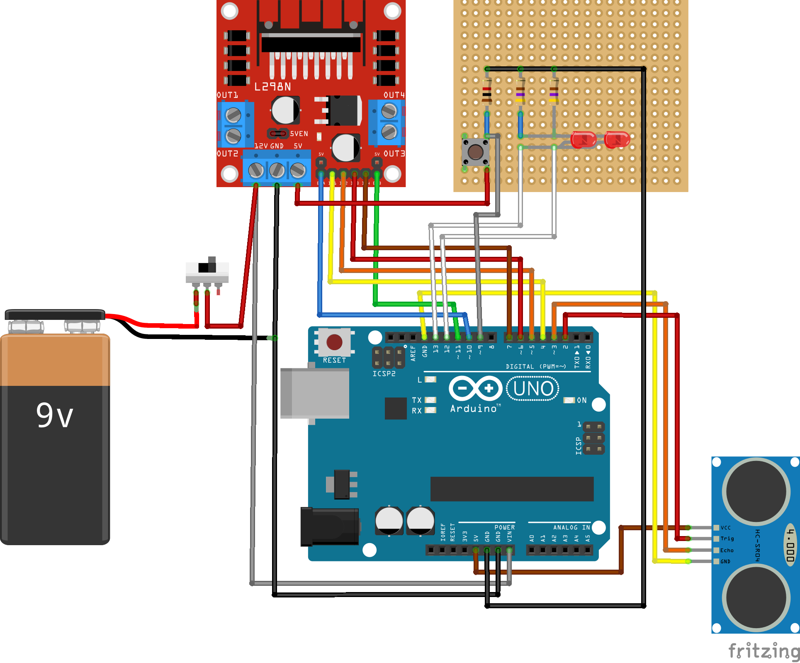

# Robot
Este es un pequeño proyecto qur hice de un robot evasor de objetos que hice para practicar el uso de git y github, y como una practica para el [curso de Fundamentos del Desarrollo de Hardware con Arduino de Platzi](https://platzi.com/cursos/fundamentos-arduino/)

# Lista de materiales

1. Un Arduino UNO
2. Un módulo ultrasonico HC-SR04
3. Un módulo L298
4. Dos resistencias de 470 ohms
5. Una resistencia de 1 kilo ohms
6. Dos leds
7. Un pulsador
8. Una placa multipropócioto
9. Una bateria de 9 volts
10. Un interruptor
11. Dos motores con ruedas
12. Una base sobre la que poder montar todo

## Esquema de conecciones

El mismo se encuentra en la carpeta **schematic** en conjunto con el proyecto de Fritzing por si lo necesitas



# Cargar el firmware

Para subir el proyecto al arduino primero necesitamos tener [Platformio CLI](https://docs.platformio.org/en/latest/core/index.html) instalado en conjunto con sus [Shell Commmands](https://docs.platformio.org/en/latest/core/installation/shell-commands.html) y las [99-platformio-udev.rules](https://docs.platformio.org/en/latest/core/installation/udev-rules.html), y también necesitamos descargar la libreria [PinChageInterrupt](https://github.com/NicoHood/PinChangeInterrupt)

Primero descargamos el firmware desde aqui mismo apretando en el boton de Code, puede ser como un archivo .zip el para abrir hay que decomprimirlo o con un `git clone` a este repo.

Luego conectamos el arduino a la PC, abrimos una terminal en la carpeta del proyecto y escribimos:

```bash
$ pio init # iniciamos el proyecto
$ pio lib install "/ruta/hacia/PinChangeInterrupt.zip" # instalamos la librería
$ pio run # compilamos
$ pio run --target upload # lo cargamos
```